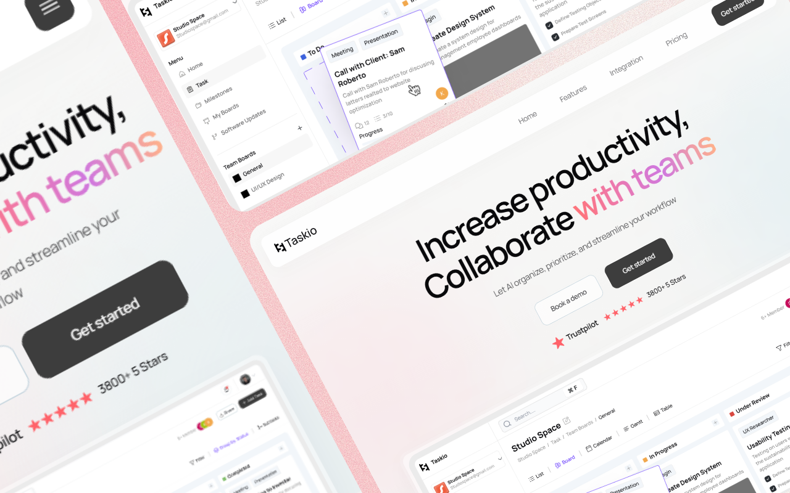

# Taskio — Hero Landing Page


A responsive hero section for **Taskio**, a fictional AI-powered productivity and team collaboration SaaS. Built with vanilla HTML, CSS, and JavaScript — no frameworks, no build step.



## Overview

This repo contains the hero/landing section of the Taskio concept site: a gradient headline, product screenshot mockup, CTA buttons, and a Trustpilot-style social proof badge, wrapped in a responsive navbar with a mobile menu.

Only the hero section is implemented. The **Features**, **Integration**, and **Pricing** nav links currently point to empty section anchors and are not built out yet.

## Features

- Responsive navbar with animated mobile menu toggle
- Scroll-reveal entrance animations on hero elements (`data-reveal` attributes)
- Gradient hero heading and background accents
- Product dashboard mockup with `fetchpriority="high"` for LCP
- Trustpilot-style rating badge
- Ionicons 7.4.0 for iconography
- Manrope variable-weight typeface via Google Fonts
- Semantic HTML with `aria-label`s for navigation and rating region

## Tech Stack

| Layer      | Tool                          |
| ---------- | ------------------------------ |
| Markup     | HTML5                          |
| Styling    | CSS3 (custom properties, no framework) |
| Behavior   | Vanilla JavaScript             |
| Icons      | [Ionicons](https://ionic.io/ionicons) (CDN) |
| Typography | [Manrope](https://fonts.google.com/specimen/Manrope) (Google Fonts) |

## Project Structure

```
hero-landing-page-taskio/
├── assets/          # logo, favicon, dashboard illustration
├── css/
│   └── style.css
├── js/
│   └── script.js
└── index.html
```

## Getting Started

No build tools required.

```bash
git clone https://github.com/NSniha/hero-landing-page-taskio.git
cd hero-landing-page-taskio
```

Open `index.html` directly in a browser, or serve it locally (recommended, for correct relative asset paths):

```bash
npx live-server
```

## Scope

This build focuses on the hero section only, as a standalone UI practice piece. The Features, Integration, and Pricing nav links are placeholder anchors for where those sections would go in a full page — they are not built out here by design, not left unfinished.

## Author

**NSniha** — Frontend Developer
[GitHub](https://github.com/NSniha)
